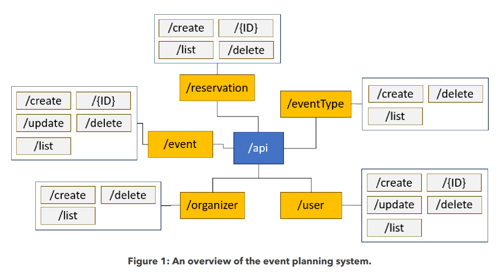
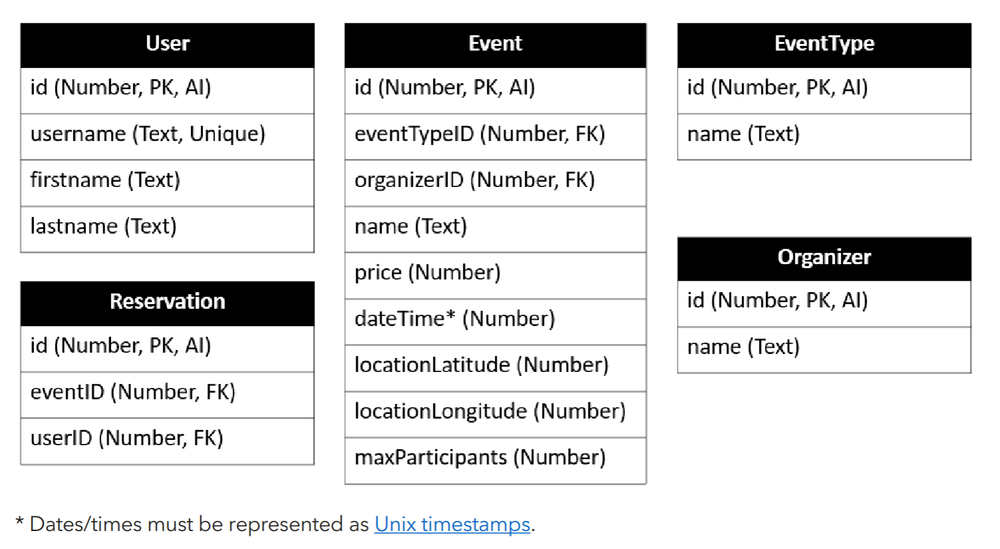

# Event Organizer System

##  About
This is University Assignment where I'm supposed to implement RESTful API with `Express.js`, `SQLite` with use of any `ORM` and `EJS`. Also `Postman` tests are needed to be implemented.

The purpose of this API is an event organizing system. 

## How to run
### Dev
1. Clone this project and go to the root with `cd ./event-orginizer-rest-api`
2. Install dependencies with `npm i`
3. Run `npm run start:dev`
4. Go to `http://localhost:3000`
> Dev version uses `nodemon` and on each save it restarts

### Production
1. Clone this project and go to the root with `cd ./event-orginizer-rest-api`
2. Install dependencies with `npm i`
3. Run `npm run start`
4. Go to `http://localhost:3000`

## Description
#### API Overview

---

#### Entities Schema

---

## Author
@limarkdl / `ID: 21078541`

